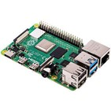
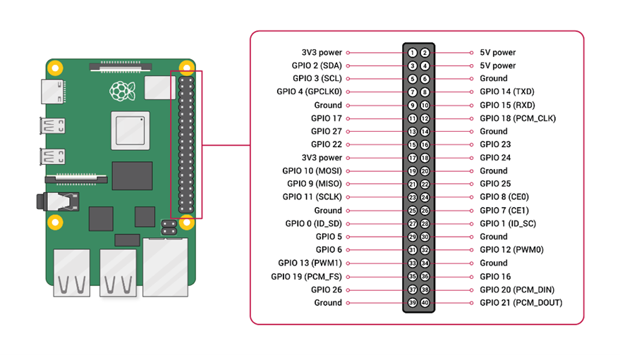

# Raspberry Pi

Raspberry Pi fungerer som hovedprosessoren i Balltrack-systemet og kjører all programvare relatert til sanntidskontroll, PID-regulering, kommunikasjon og brukergrensesnitt.
Maskinvaren består av et ARM-basert mikrodatakort med 3.3 V logikk og et komplett Linux-operativsystem (Raspberry Pi OS).

## Funksjon i systemet
-	Pi-en fungerer som hjernen i systemet:
-	Leser sensorverdier
-	Beregner reguleringssignalet i PID-algoritmen (Python).
-	Sender servo-posisjoner til PCA9685-modulen via       I²C-protokollen.
-	Kjører GUI (Tkinter) som lar brukeren overvåke systemet, endre PID-verdier og observere responser i sanntid.

## Kobling
-	3.3 V brukes som logikknivå for kommunikasjon.
-	5 V fra Tagan PSU brukes til å forsyne Raspberry Pi via GPIO 5V.
-	Felles GND kobles til både Arduino, PCA9685 og servoens jord.

¨
Raspberry Pi bruker to kommunikasjonsgrensesnitt parallelt:
-	I²C (SDA = GPIO 2, SCL = GPIO 3) for kommunikasjon med PWM-modulen.
-	USB-serial (ttyACM0) for kommunikasjon med Arduino, som leverer sensorverdier.

Pi-en driver ikke servoen direkte, siden PWM-signalene fra Pi har lav oppløsning og er programvarebasert, og dermed for ustabile til presis servo-kontroll. I stedet sendes kommandoer til en ekstern PWM-driver (PCA9685).