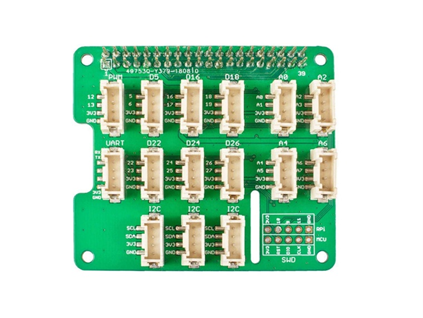

# Grove - Base HAT – ADC-grensesnitt

ADC-HAT-en fungerer som systemets analog-til-digital-omformer (ADC).

Grunnen til at ADC-HAT benyttes, er at Raspberry Pi ikke har egne analoge innganger og dermed ikke kan lese spenningssignalet direkte fra softpot-sensoren.

ADC-HAT-en støtter flere analoge kanaler, kommuniserer via I²C og leverer 12-bit oppløsning (0–4095), noe som gir betydelig høyere nøyaktighet enn andre løsninger.

## Funksjon

ADC-HAT-en gjør følgende:
-	Mates direkte fra Raspberry Pi (3.3 V logikk og 5 V forsyning).
-	Gir 3.3 V referansespenning til SoftPot-sensorens VCC-pin.
-	Leser sensorens midtpinne (utgangsspenning) som et analogt signal på A0.
-	Konverterer denne spenningen (0–3.3 V) til en digital verdi mellom 0 og 4095 via sin 12-bit ADC.
-	Sender verdien videre til Python-programmet på Raspberry Pi via I²C-bussen (adresse 0x08).
-	Dette gjør at systemet får en jevn datastrøm med posisjonsmålinger som brukes i PID-reguleringen.

## Virkemåte ADC-HAT

ADC-HAT-en bruker en integrert sample-and-hold-forsterker og en 12-bit suksessiv tilnærming-konverter (SAR).
 ADC-inngangen har høy impedans (>100 MΩ), som gjør at sensoren ikke belastes og gir stabile måleresultater.

SoftPot-sensoren fungerer som en lineær spenningsdeler, og ADC-HAT-en måler utgangsspenningen fra kontaktpunktet mellom lagene i sensoren.

Dette gir en fast datastrøm til Pi-en som Python-koden deretter bruker som målesignal  .
