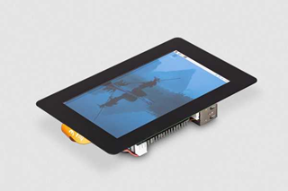

# LCD Touch-skjerm

Systemet benytter en Raspberry Pi-kompatibel touchskjerm som fungerer som HMI (Human–Machine Interface). På skjermen kjøres en Tkinter-basert GUI som lar brukeren overvåke reguleringen i sanntid og justere parametere uten ekstern PC.