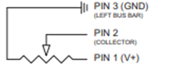
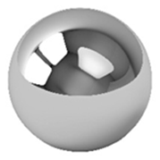

# Posisjonsmåling: SP-L-0400-203-3%-ST

Softpot-sensoren fungerer som en lineær posisjonssensor basert på variabel motstand.
Den består av en tynn polymerfilm med et resistivt belegg (totalt ca. 20 kΩ) og en toppfilm med ledende spor. Når en metallkule ligger oppå, skapes kontakt mellom de to lagene og gir en bestemt resistans ut fra kontaktpunktet.

For at posisjonssensoren (softpot) skal fungere korrekt, kreves et minimumstrykk på sensorelementet. Sensoren spesifiserer et aktiveringstrykk på minimum 1N. Dette gir et krav til kulens masse, som kan beregnes ved:

Oppbygging av soft pot:

## Måleprinsipp

Fungerer etter prinsippet om spenningsdeling i en resistiv krets.

Mellom de to ytterpunktene (Pin 1 og Pin 3) ligger en fast motstand R_total = 20kΩ.

Midtpinnen (Pin 2) henter ut en spenningsdeler basert på ballens plassering 
Hvor  og  motstandene til venstre og høyre for kontaktpunktet.

Ballens posisjon konverteres slik til et linært spenningssignal mellom 0-3 V. Når ballen ligger i midten - ca. 1,5 V.
Raspberry pi-en leser dette som en digital verdi ≈ 512.

## Elektrisk kobling

Pin 3 - Jord (GND)

Pin 2 - Utgangspenning (posisjon)

Pin 1 - 3V forsyning fra PI-en

## Ball/Kule

Som reguleringsobjekt i BallTrack-systemet er det benyttet en stålkule. Kulen fungerer som den mekaniske lasten i systemet, og dens posisjon langs bjelken er det som reguleres av PID-algoritmen.

For at posisjonssensoren (softpot) skal aktiveres korrekt, kreves et minimumstrykk på 1 N. Dette stiller krav til kulens masse. Basert på beregninger gir dette en nødvendig masse på minimum ca. 102 gram. Den valgte stålkulen har en diameter på 30 mm og en masse på omtrent 150 gram, noe som gir tilstrekkelig trykk og stabile måleforhold.

Kulen gir et godt kompromiss mellom masse og rulleegenskaper, og bidrar til forutsigbar dynamikk i reguleringssløyfen.